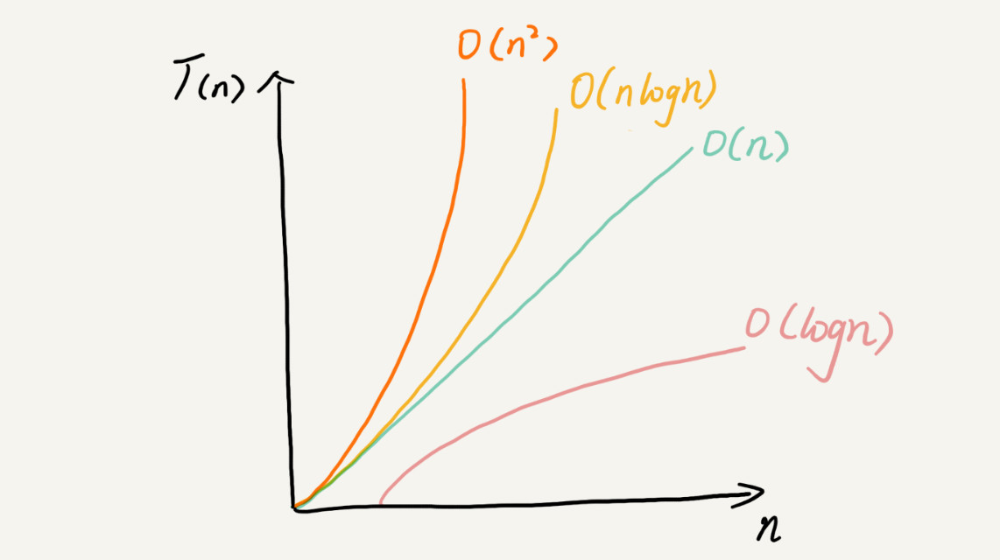

# 数据结构与算法

> 数据结构其实就是一组数据的存储结构，而算法就是操作数据的一种方法。

数据结构和算法本身解决的是「快」和「省」的问题 ，那么如何评判你的代码有多快，有多省呢？

# 复杂度分析

## 为什么需要复杂度分析

常规的测试代码性能的方法都需要代码编写完毕之后才可以得出结果，并且测试结果还受测试数据的影响，而我们需要的是一个**不用具体的测试数据来测试，也不需要运行代码就可以粗略的估计算法的执行效率的方法。**

## 大 O 复杂度表示法

算法的执行效率，粗略地讲，就是算法代码执行的时间

```ts
const add = () => {
  let sum = 0
  for (i = 0; i < n; i++) {
    for (j = 0; j < n; j++) {
      sum += i * j
    }
  }
}
```

我们假设每行代码执行的时间都一样，为 unit_time。

可以看到，第 2 行代码执行了一次，需要 1 个 unit*time 的执行时间，第 3 行代码执行了 n 次，因此需要 n * unit*time 的执行时间，第 5、6 行代码执行了 n^2 遍，所以需要 2 n^2 * unit_time 的执行时间，所以整段代码的执行时间 T(n) = ( 2n^2 + n + 1) \* unit_time。可以看出，**所有代码的执行时间 T(n) 与每行代码的执行次数成正比**

但我们的大 O 复杂度实际上并不具体表示代码真正的执行时间，而是**表示代码执行时间随数据规模增长的变化趋势，也叫做渐进时间复杂度，简称时间复杂度。**

当 n 很大时，公式中的低阶、常量、系数三部分并不能左右增长的趋势，所以都可以忽略。我们只需要记录一个最大量级就可以了。因此上述代码片段的时间复杂度可记为 T(n) = O( n^2)

## 时间复杂度分析方法

1. 只关注循环执行次数最多的一段代码
2. 一段代码由多部分组成时，总复杂度等于量级最大的那段代码的复杂度
3. 嵌套代码的复杂度等于嵌套内外代码复杂度的乘积

### 最好、最坏情况时间复杂度

但是某些情况下，时间复杂度并不能单纯的被定义

```ts
// n表示数组array的长度
const find = (array: number[], n: number, x: number) => {
  let i = 0
  let pos = -1
  for (; i < n; ++i) {
    if (array[i] == x) {
      pos = i
      break
    }
  }
  return pos
}
```

在这段代码中，我们并不能确定循环的代码执行了多少次，如果数组中第一元素刚好是要查找的变量 x，那就只执行了一次，时间复杂度就是 O(1)。但如果数组中不存在变量 x,那我们就需要把整个数组都遍历一遍，时间复杂度就成了 O(n)。**因此我们只能说它最好情况下复杂度为 O(1), 最坏情况下的复杂度为 O(n)**

## 常见的复杂度实例



常见的复杂度量级并不多，可以粗略的分为两类

### 非多项式量级

非多项式量级只有两个：O(2^n) 和 O(n!)，当数据规模 n 越来越大时，非多项式量级算法执行时间会急剧增加，是非常低效的算法。

### 多项式量级

- O(1): 一般情况下，只要算法中不存在循环语句，递归语句，即使有成千上万行的代码，其时间复杂度也是 O(1)
- O(logn)、O(nlogn):

```ts
let i = 1
while (i <= n) {
  i = i * 2
}
```

- O(n^k)
- O(m+n)、O(m \* n)

## 空间复杂度分析

表示**算法的存储空间与数据规模增长的变化趋势**

例如申请了一个 n 长度的数组，则空间复杂度就为 O(n)，常见的空间复杂度就是 O(1)、O(n)、O(n^2)，没有时间复杂度那样难分析。
