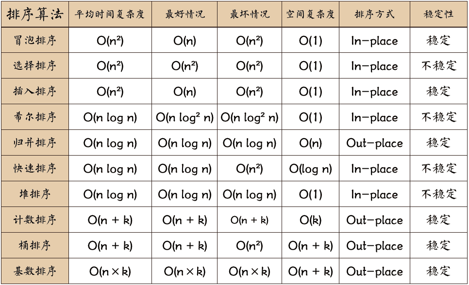

# 排序

> 在计算机科学与数学中，一个排序算法（英语：Sorting algorithm）是一种能将一串资料依照特定排序方式进行排列的一种算法。



**排序算法的内存消耗**：

算法的内存消耗可以通过空间复杂度来衡量，针对排序算法的空间复杂度，我们还引入新的概念：**原地排序「sorted in place」**，用来特指空间复杂度是 O(1) 的排序算法。

**排序算法的稳定性**：

如果待排序的序列中存在值相等的元素，经过排序之后，**相等元素之间原有的先后顺序不变。**

那有什么用呢，假设你有一组订单数据，订单包含两个属性，一个是下单时间，一个是订单金额，我们希望按照金额从小到大进行排序，金额相等的订单按照下单时间从早到晚排序。对于稳定的排序算法，我们只需要先按照下单时间从早到晚进行排序，然后再按照金额从小到大进行排序即可，**因为第二次按照金额从小到大进行排序的后金额相等的订单还会保持原有的先后顺序不变**。但假如排序算法不稳定，则实现起来就会相对麻烦很多。

## 冒泡排序

> 冒泡排序是一种交换排序，它的基本思想是：两两比较相邻记录的关键字，如果反序则交换，直到没有反序的记录为止。


```ts
const arr = [3, 5, 4, 1, 2, 6]

const bubbleSort = <T>(arr: T[]) => {
  const len = arr.length
  for (let i = 0; i < len - 1; i++) {
    let flag = false
    for (let j = 0; j < len - i - 1; j++) {
      if (arr[j] > arr[j + 1]) {
        const temp = arr[j + 1]
        arr[j + 1] = arr[j]
        arr[j] = temp
        flag = true
      }
    }
    // 如果某次冒泡操作没有数据交换，说明已经达到完全有序
    if (!flag) break
    console.info(i) // 0 1 2
  }

  return arr
}
```

## 插入排序

> 插入排序，一般也被称为直接插入排序。对于少量元素的排序，它是一个有效的算法。插入排序是一种最简单的排序方法，它的基本思想是将一个记录插入到已经排好序的有序表中。在其实现过程使用双层循环，外层循环对除了第一个元素之外的所有元素，内层循环对当前元素前面有序表进行待插入位置查找，并进行移动


```ts
const insertionSort = <T>(arr: T[]) => {
  const len = arr.length
  for (let i = 1; i < len; i++) {
    const value = arr[i]
    let j = i - 1
    for (; j >= 0; j--) {
      if (arr[j] > value) {
        arr[j + 1] = arr[j]
      } else {
        break
      }
    }
    // 当左侧的数值都比右侧大，循环不会主动跳出，循环结束时 j 为 -1
    arr[j + 1] = value
  }
  return arr
}
```

## 选择排序

> 选择排序是一种简单直观的排序算法。它的工作原理是：第一次从待排序的数据元素中选出最小（或最大）的一个元素，存放在序列的起始位置，然后再从剩余的未排序元素中寻找到最小（大）元素，然后放到已排序的序列的末尾。以此类推，直到全部待排序的数据元素的个数为零。


```ts
const selectionSort = <T>(arr: T[]) => {
  const len = arr.length
  for (let i = 0; i < len - 1; i++) {
    let minIndex = i
    for (let j = i + 1; j < len; j++) {
      if (arr[minIndex] > arr[j]) {
        minIndex = j
      }
    }
    const temp = arr[minIndex]
    arr[minIndex] = arr[i]
    arr[i] = temp
  }
  return arr
}
```

## 归并排序

> 归并排序「MERGE-SORT」是利用归并的思想实现的排序方法，该算法采用经典的分治「divide-and-conquer」策略（分治法将问题分成一些小的问题然后递归求解，而治的阶段则将分的阶段得到的各答案"修补"在一起，即分而治之)。

### 思路分解图


### 演示动图


### 代码实现

```ts
const array = [4, 2, 5, 1, 6, 3]

const mergeSort = (arr: number[]) => {
  mergerSortIteration(arr, 0, arr.length - 1)
}

const mergerSortIteration = (arr: number[], l: number, r: number) => {
  // 当排序数组中只有一个值时，返回该值
  if (l >= r) {
    return
  }

  const mid = Math.floor(l + (r - l) / 2)
  // 左侧递归排序
  mergerSortIteration(arr, l, mid)
  // 右侧递归排序
  mergerSortIteration(arr, mid + 1, r)
  // 将排好序的数组合并
  merge(arr, l, mid, r)
}
```

对于两边有序的数组可以快速按序的合并


```ts
const merge = (arr: number[], l: number, mid: number, r: number) => {
  const temp = []
  let k = 0
  let i = l
  let j = mid + 1

  while (i <= mid && j <= r) {
    if (arr[i] < arr[j]) {
      temp[k++] = arr[i++]
    } else {
      temp[k++] = arr[j++]
    }
  }

  let start = i
  let end = mid
  if (j <= r) {
    start = j
    end = r
  }
  // 将左右侧剩余的数据添加的 temp 数组中去
  while (start <= end) {
    temp[k++] = arr[start++]
  }
  // 将 temp 的数组拷贝到 arr
  for (let n = 0; n <= r - l; n++) {
    arr[n + l] = temp[n]
  }
}
```

可以利用哨兵去简化合并的代码

```ts
const mergeFunc = (arr: number[], l: number, mid: number, r: number) => {
  const leftArr = []
  const rightArr = []

  let i = 0
  while (i <= mid - l) {
    leftArr[i] = arr[i + l]
    i++
  }
  // 添加哨兵
  leftArr.push(Infinity)

  let j = 0
  while (j < r - mid) {
    rightArr[j] = arr[mid + j + 1]
    j++
  }
  // 添加哨兵
  rightArr.push(Infinity)

  let k = l
  let lIndex = 0
  let rIndex = 0
  while (k <= r) {
    if (leftArr[lIndex] < rightArr[rIndex]) {
      arr[k++] = leftArr[lIndex++]
    } else {
      arr[k++] = rightArr[rIndex++]
    }
  }
}
```

## 快速排序

> 快速排序，又称分区交换排序，简称快排，一种排序算法，最早由东尼·霍尔提出。快速排序使用分治法策略来把一个序列分为较小和较大的 2 个子序列，然后递归地排序两个子序列。

快速排序为自上而下，而归并排序是自下而上的

## 思路分解图


这张图采用的是额外创建两个数组来排序，这里只是方便演示，其实是可以原地排序的。

## 演示动图


## 代码

```ts
const array = [4, 2, 5, 1, 6, 3]

const quickSort = (arr: number[]) => {
  quickSortInner(arr, 0, arr.length - 1)
}

const quickSortInner = (arr: number[], l: number, r: number) => {
  if (l >= r) return

  const q = participant(arr, l, r)
  quickSortInner(arr, l, q - 1)
  quickSortInner(arr, q + 1, r)
}
```


采用原地排序，从左到右依次遍历，如果比基准值小的话转换到数组的前半部分，遍历完后再将基准值交换

```ts
const participant = (arr: number[], l: number, r: number): number => {
  const refer = arr[r]
  let k = l
  for (let i = l; i < r; i++) {
    if (arr[i] < refer) {
      const temp = arr[i]
      arr[i] = arr[k]
      arr[k] = temp
      k++
    }
  }
  // 最后将 refer 放到「中间」
  arr[r] = arr[k]
  arr[k] = refer

  return k
}
```

## 桶排序

> 桶排序的核心思想是将要排序的数据分到有序的桶里，每个桶里的数据再单独进行排序。桶内排完序之中，再把每个桶里的数据按照顺序依次取出，组成的序列就是有序的了


桶排序的时间复杂度为什么是 O(n) 呢？假如我们排序的数据有 n 个，我们把它们均匀地划分到 m 个桶内，每个桶里就有 k=n/m 个元素。每个桶内部使用快速排序，时间复杂度为 O(klogk)。m 个桶排序的时间复杂度就是 O(mklogk)，因为 k=n/m，所以复杂度整个桶排序的复杂度就是 O(nlog(n/m))。当桶的个数 m 接近总数 m 时， log(n/m) 就是一个非常小的常亮，这个时候桶排序的时间复杂度接近 O(n)

**桶排序比较适合用在外部排序中**。即数据存储在外部磁盘中，数据量比较大，内存有限，无法将数据全部加载到内存中。因此可以把文件均匀拆分到 100 个小文件中，把这 100 个小文件依次放入内存中去排序。假如文件还是过大，则再去均分，直到所有文件都能读入内存为止。

## 计数排序

> 计数排序其实是桶排序的一种特殊情况。当要排序的 n 个数据，所处的**范围并不大的时候**，比如最大值是 k，我们就可以把数据划分成 k 个桶。每个桶内的数据值都是相同的，省掉了桶内排序的时间。


假如考生满分是 900 分，最小是 0 分，这个数据范围很小，所以我们可以分成 901 桶，对应分数从 0 分到 900 分。根据考生的成绩，我们将这 50 万考生划分到 901 个桶里。桶内的数据都是分数相同的学生，所以不再需要进行排序。我们只需要依次扫描每个桶，将桶内的考生依次输出到一个数组里，就实现了 50 万考生的排序。

假设只有 8 个考生，分数在 0 到 5 分之间。这 8 个考生的成绩我们放在一个数组 `A[8]` 中，它们分别是：2，5，3，0，2，3，0，3。

考生的成绩从 0 到 5 分，我们使用大小为 6 的数组 `C[6]` 表示桶，其中下标对应分数。不过，`C[6]` 内存储的并不是考生，而是对应的考生个数。像我刚刚举的那个例子，我们只需要遍历一遍考生分数，就可以得到 `C[6]` 的值


为了快速计算出每个分数的考生在序列中的位置，我们采取一个比较巧妙的思路。我们首先对 `C[6]` 数组中的值顺序求和，得到如下数据


然后我们从后往前遍历数组 A, 首先拿到数值 3，然后去查看 `C[3]` 为 7，则证明小于等于 3 的数值有 7 个，此时创建一个数组 R，并把 `R[7]` 置为 3，然后将 `C[3]` 减 1。依次类推，如下图所示


计数排序只能用在数据范围不大的场景中，如果数据范围 k 比要排序的数据 n 大很多，就不适合用计数排序了。而且，计数排序只能给非负整数排序，如果要排序的数据是其他类型的，要将其在不改变相对大小的情况下，转化为非负整数。
