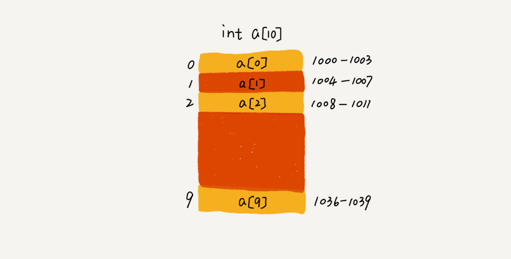

# 数组

> 数组是一种线性表数据结构。它用一组连续的内存空间，来存储一组具有相同类型的数组

## 随机访问

连续的内存空间和相同的数据类型让数组拥有了「随机访问」的特性。

我们拿一个长度为 10 的 int 类型的数组 int[] a = new int[10] 来举例，假如内存的首地址 base_address = 1000



计算机会给每个内存单元分配一个地址，计算机通过地址来访问内存中的数据。当计算机需要随机访问数组中的某个元素时，它会首先通过下面的寻址公式，计算出该元素存储的内存地址

```
a[i]_address = base_address + i * data_type_size
```

## 数组下标开始为 0

从数组存储的内存模型上来看，「下标」最确切的定义应该是「偏移」。如果用 a 来表示数组的首地址，a[0] 就是偏移为 0 的位置，也就是首地址，a[k]就表示偏移 k 个 type_size 的位置，也就是上面说到的那个公式。

但是如果数组从 1 开始计数，那我们计算数组元素 a[k] 的内存地址就会变为

```
a[k]_address = base_address + (k-1) * type_size
```

这个公式会让每次访问数组元素都多了一次减法运算，对于 CPU 来说，就是多了一次减法指令。而数组作为非常基础的数据结构，通过下标随机访问数组元素又是非常基础的编程操作，效率的优化就要尽可能的做到极致。

## 低效的「插入」和「删除」

为了保持内存数据的连续性，会导致插入、删除这两个操作比较低效。
