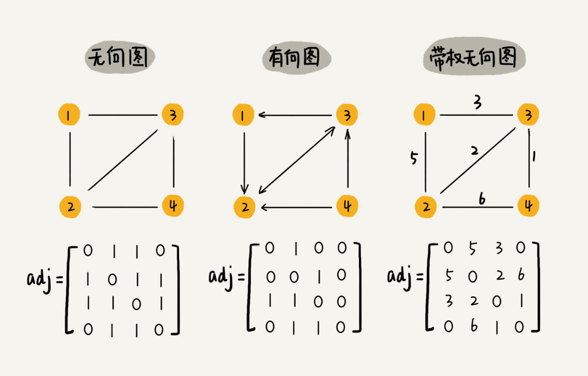

# 图

图通常用来表示和存储具有「多对多」关系的数据，是数据结构中非常重要的一种结构。

## 无向图

图中的元素我们叫做顶点「vertex」
一个顶点可以与任意其他顶点建立连接关系，我们把这种建立的关系成为「边」
与顶点相连接的边的个数称为该顶点的「度」。

## 有向图

对于有序图来说，有多少边指向该顶点称为「入度」，有多少边是以该顶点为起点指向别的顶点的称为「出度」

我们拿微博来举例，图可以很好的用来表示微博的用户对应的关系，用户即为顶点，其中关注的人数即为出度，而粉丝量即为入度。

## 带权图

在 qq 中，每个好友都有亲密度，如果两个好友频繁往来，其亲密度也会更高，反应到图中即为带权图

## 邻接矩阵存储方法

邻接矩阵的底层依赖一个二维数组，对于无向图来说，如果顶点 i 与顶点 j 之间有边，我们就将 A[i][j]和 A[j][i]标记为 1；对于有向图来说，如果顶点 i 到顶点 j 之间，有一条箭头从顶点 i 指向顶点 j 的边，那我们就将 A[i][j]标记为 1。同理，如果有一条箭头从顶点 j 指向顶点 i 的边，我们就将 A[j][i]标记为 1。对于带权图，数组中就存储相应的权重。

但对于无向图来说，其实这种存储方式有一半是浪费的，因为 A[i][j] 为 1 即表示有边，并不需要存储 A[j][i]。而且对于微信好几亿的用户，对应到二维数组中则为亿 × 亿的数据量，但是每个用户的好友最多可能也只要几百个而已，这也就造成了大量的存储空间的浪费。

## 邻接表存储方法

针对上面所说的空间浪费的问题，我们采用了邻接表的存储方法。

我们采用散列表的存储方法，对于上图的有向图，左侧为图中的顶点，右侧的链表记录的是指向的顶点，当然无向图亦是如此。右侧的数据结构也不一定非得是链表，可以根据场景替换成平衡二叉树或者更有效的数据结构。

## 应用

微博、微信、qq 等

对于微博这种例子，其实是需要两个邻接表，因为正常的邻接表可以很容易找出指向的顶点，但是很难确认有多少顶点指向自己，因此还要一个逆邻接表来存储有多少顶点指向自己。

