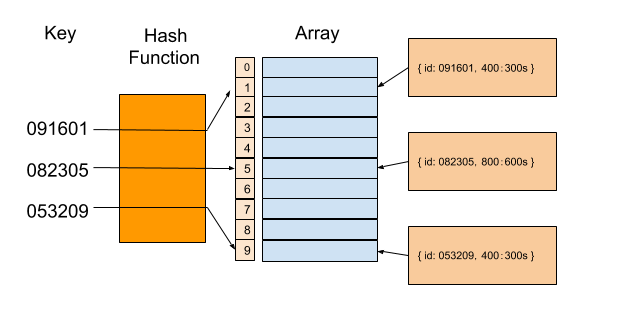
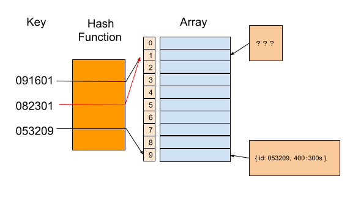
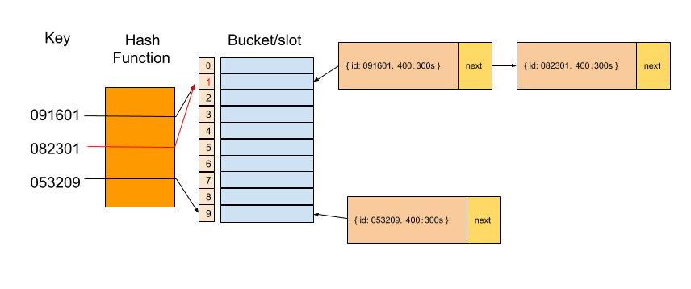

# 散列表

散列表「Hash table，也叫哈希表」，是根据键「Key」而直接访问在内存存储位置的数据结构。也就是说，它通过计算一个关于键值的函数，将所需查询的数据映射到表中一个位置来访问记录，这加快了查找速度。这个映射函数称做散列函数，存放记录的数组称做散列表。

散列表使用「散列函数」来计算一个值在数组或桶或槽中对应的索引，然后将真正的值存储进去，之后便可以使用该索引准确的找到这个值。

某学校举行运动会，每个人都有对应的编号，编号为 6 位数，前两位为年级，中间两位为班级，后两位为编号。如果我们希望快速通过编号找到对应选手的信息，那应该怎么做呢？



我们的散列函数如下

```ts
const hashFunc = (key: number) => {
  return parseInt(key.toString().subStr(-2))
}
```

通过散列函数我们截取了六位编号的后两位来作为数组的下标，并在数组该下标处存储该选手的参赛项目和对应成绩。当需要通过参赛选手编号查询选手信息的时候，同样我们通过散列函数来获取数组下标，去获取其对应的信息。这种方式的查找时间复杂度可以为 O(1)，是非常迅速的。

## 散列冲突

当多个 key 值通过散列函数返回同一个索引时，我们称这种情况情况为「散列冲突」



### 开放寻址法

开放寻址法的核心思想是，如果出现了散列冲突，我们就重新探测一个空闲位置，将其插入。

那如何重新探测新的位置呢？当我们往散列表中插入数据时，如果某个数据经过散列函数散列之后，存储位置已经被占用了，我们就从当前位置开始，依次往后查找，看是否有空闲位置，直到找到为止。

查找数据和插入数据相仿，我们通过散列函数求出要查找元素的键值对应的散列值，然后比较数组中下标为散列值的元素和要查找的元素。如果相等，则说明就是我们要找的元素；否则就顺序往后依次查找

但要特别注意，我们删除时不能仅仅执行删除操作，因为删除之后该位置就为空了，会影响到前面的查找操作，当查找到空位置时，查找操作停止，但此时的空位置可能是我们刚刚的删除操作造成的，因此们删除过数据后要标记一下


### 链表法



当插入的时候，我们只需要通过散列函数计算出对应的散列槽位，将其插入到对应链表中即可，所以插入的时间复杂度是 O(1)。当查找、删除一个元素时，我们同样通过散列函数计算出对应的槽，然后遍历链表查找或者删除

### 总结

当数据量比较小、适合采用开放寻址法。基于链表的散列冲突处理方法比较适合存储大对象、大数据量的散列表，而且，比起开放寻址法，它更加灵活，支持更多的优化策略，比如用红黑树代替链表。