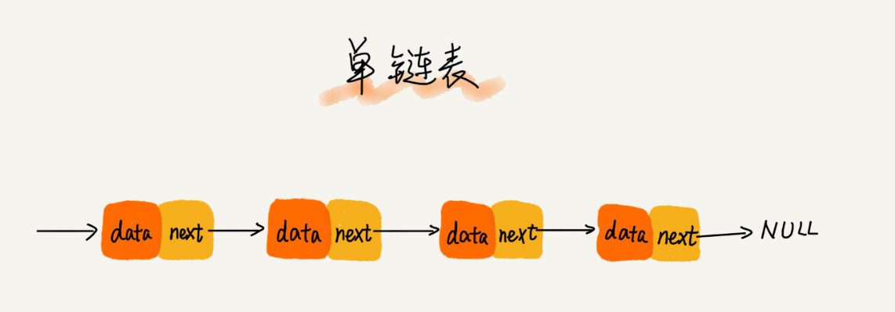
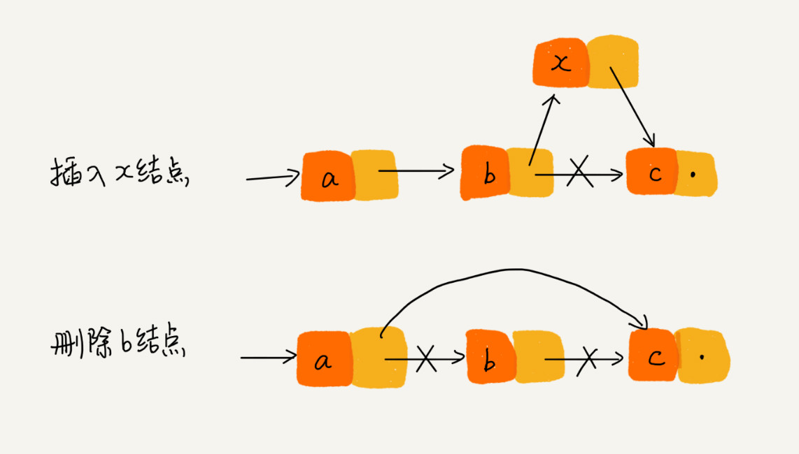
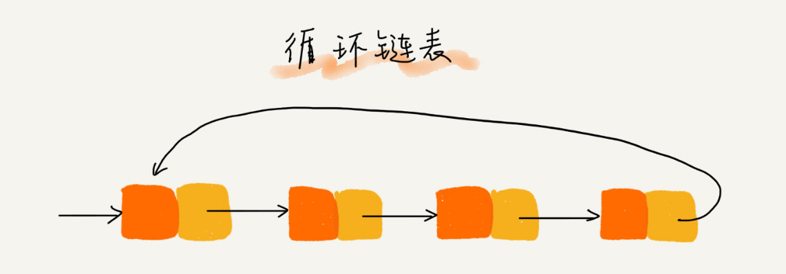
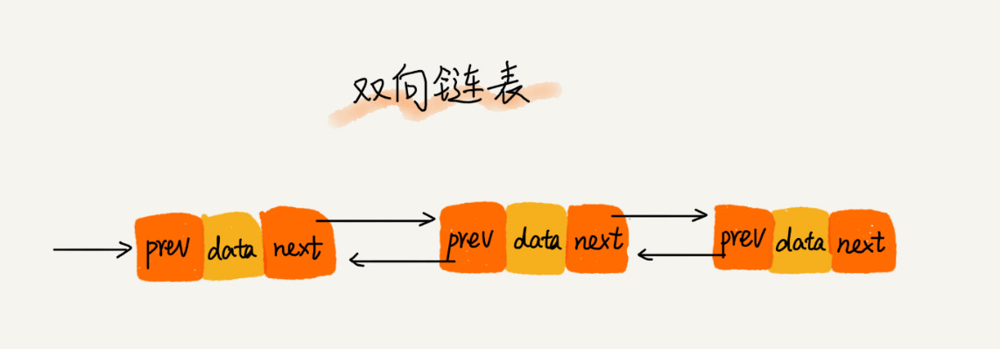
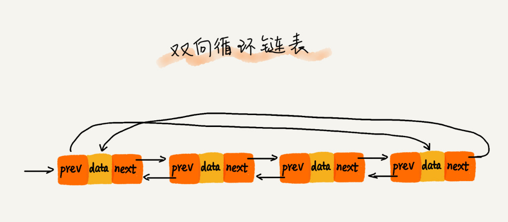
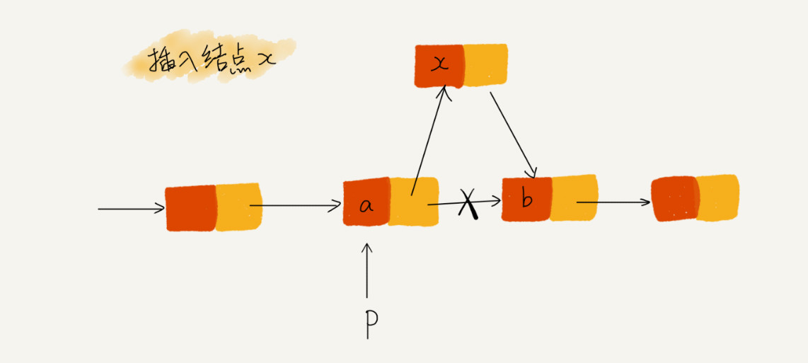
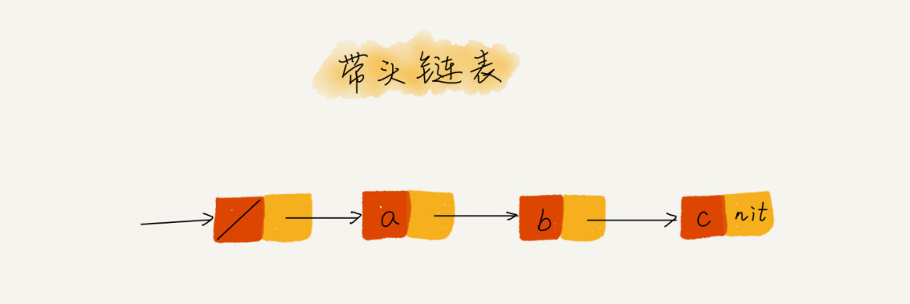

# 链表

链表不需要一块连续的内存空间，它通过指针将一组零散的内存块串联起来使用

## 单链表



第一个结点为头结点，最后一个结点为尾结点。与数组一样，链表同样也支持数据的查找、插入和删除操作。

对于链表来说，查找会相对复杂一点，因为链表中的数据并非连续存储，并不能根据首地址和下标去寻址，只能根据指针一个结点一个结点地依次遍历，直到找到相对应的结点

链表的插入和删除操作比较简单，只需要考虑相邻结点的指针的改变



## 循环链表

循环链表其实就是一种特殊的单链表，将单链表的尾结点的指针又指向了头结点。



## 双向链表

**单向链表只有一个方向，每个结点只知道它的下一个结点是谁**。想一下我们上面说过的删除操作，假设我们要删除结点 p，我们首先需要找到 p 的前驱结点，也就是找到指针指向 p 的结点，而在单链表中，查找一个结点是需要从头遍历的，所以实际上删除的时间复杂度也是 O(n)

而双向链表支持两个方向，每个结点不仅有后继指针 next 指向后面的结点，还有一个前驱指针 prev 指向前面的结点



这样的结构可以使双向链表以 O(1) 的时间复杂度找到前驱结点，也就使插入、删除等操作变得更加高效

## 双向循环链表



## 技巧

### 理解指针或引用的含义

有些语言有「指针」的概念，比如 C 语言；有些语言没有指针，取而代之的是「引用」，比如 js、Python。不管是「指针」还是「引用」，实际上，它们的意思都是一样的，**都是存储所指对象的内存地址**

将某个变量赋值给指针，实际上就是将这个变量的地址赋值给指针，或者反过来说，指针中存储了这个变量的内存地址，指向了这个变量，我们通过指针就可以找到这个变量。

### 警惕指针丢失和内存泄漏



如图所示，我们希望在节点 a 和相邻的结点 b 之间插入结点 x，假设当前指针 p 指向结点 a。如果我们将代码实现变成下面这个样子，就会发生指针丢失和内存泄漏

```js
p -> next = x;
x -> next = p -> next;
```

这段代码执行完毕后，其实是 x → next = x 。也就是自己指向了自己，因此整个链表也就断成了两半，从结点 b 往后的所有结点都无法访问到了

正确的插入代码是将上述代码顺序颠倒过来，因此写插入时一定要注意顺序

### 利用哨兵简化实现难度

当我们在结点 p 后面插入一个新的结点，只需要下面两行代码就可以搞定

```js
new_node -> next = p -> next;
p -> next = new_node;
```

但当我们向空链表中插入一个结点时，刚刚的逻辑就无法复用了。head 表示链表的头结点

```js
if (head == null) {
  head = new_code
}
```

我们再来看单链表的删除操作

```js
p -> next = p -> next -> next;
```

但是假如我们要删除链表中的最后一个结点时，上面的代码也无法直接使用。

```js
if (head -> next == null) {
	head = null
}
```

我们可以看出，**针对链表的插入、删除操作，需要对插入第一个结点和删除最后一个结点的情况进行特殊处理。**这样的代码实现起来会比较的繁琐，不简洁，也容易因考虑不全而出错。

我们引入哨兵结点来解决这一问题，在任何时候，head 指针都会一直指向这个哨兵结点，此节点不用于存储数据。


