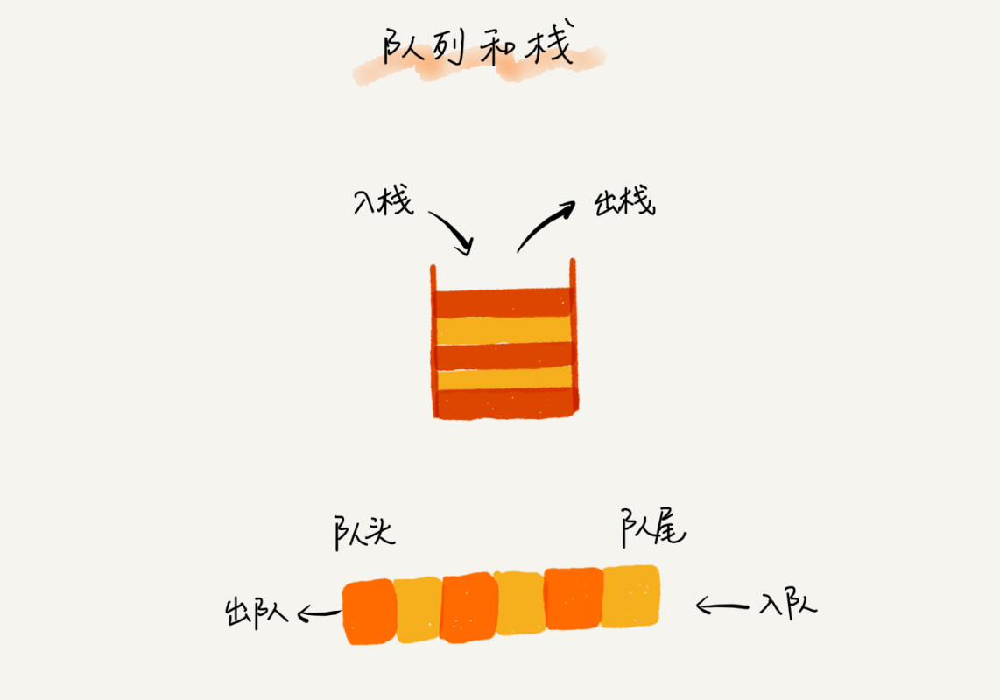
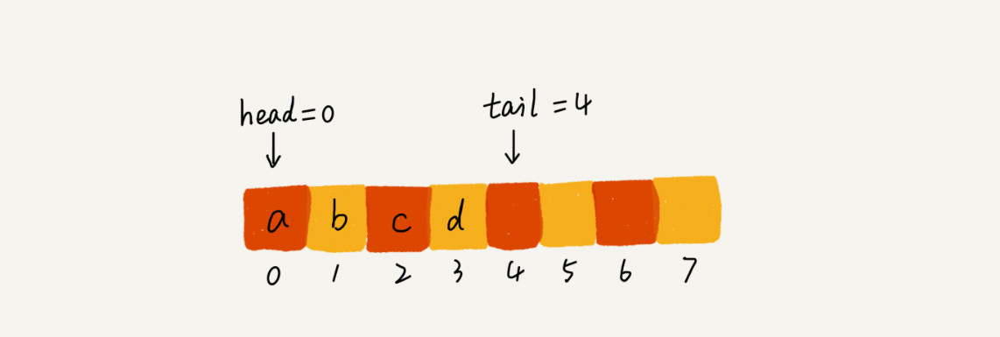
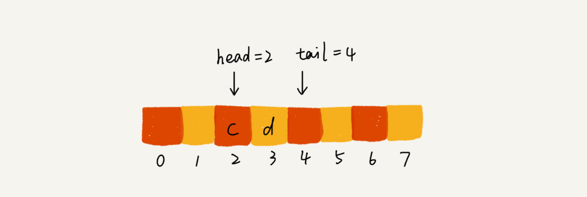
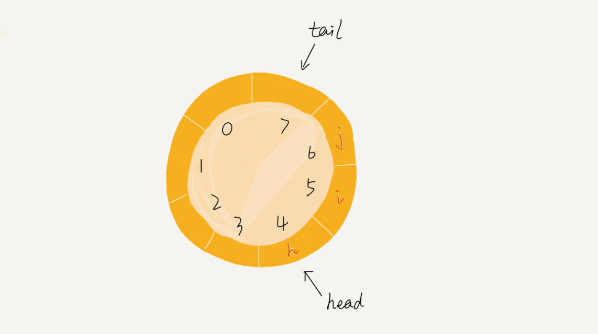
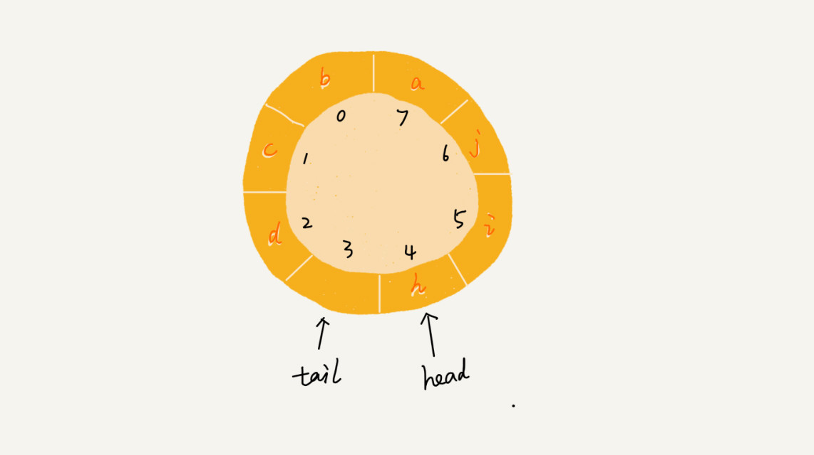

# 队列

队列即来自于我们日常生活中的排队，先来先得，后来的人只能站末尾，不允许插队。**先进先出，就是典型的「队列」**



## 顺序队列和链式队列

队列可以用数组来实现，也可以用链表来实现。用数组实现的栈叫作顺序栈，用链表实现的栈叫作链式栈。同样，用数组实现的队列叫作**顺序队列**，用链表实现的队列叫作**链式队列**。

队列的实现需要两个指针，一个头指针和一个尾指针。当 a、b、c、d 依次入队时，此时队列的结构大致如下图所示



当我们此时调用两次出队操作时，head 指针会向后移动两格， tail 指针不变化



但从这幅图中你可以看到，左边出现了空闲的区域，当你一直执行入队和出队操作时，左边的空闲位置就只会越来越多，为了解决这个问题，你就需要**数据搬移**，你可以选择在每次执行出队操作时向前搬移一位，也可以选择当队满无法入队时再检测头部是否有空余来执行搬移操作。

不过前者的入队时间复杂度变为了 O(n)，而后者出队的平均时间复杂度仍为 O(1)。因为后者执行数据搬移操作只是在极少的情况下，而不是每次都执行。

但其实这种情况在 js 中是已经被处理过的了， js 的数组提供了两个方法用来表达顺序队列

```tsx
const arr = [1, 2, 3]
arr.push(4) // [1, 2, 3, 4]
arr.shift() // [2, 3, 4]
```

可以看出 js 在每次执行出队「shift」操作时已经做好了**数据搬移**，因此你可以放心的使用 JSArray 提供的方法来表达队列

## 循环队列

循环队列主要是解决顺序队列的数据搬移的问题，因为链式队列根本不存在此问题，因此循环队列大都使用数组来实现的。



在循环队列中，队空的判断是 tail === head，那队满时怎么判断呢



为了判断队满，我们需要浪费掉一个数组的存储空间，那队满的条件就是 ( tail + 1 ) % arr.length === head
