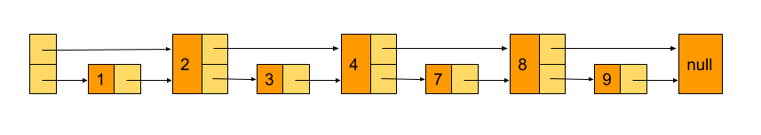
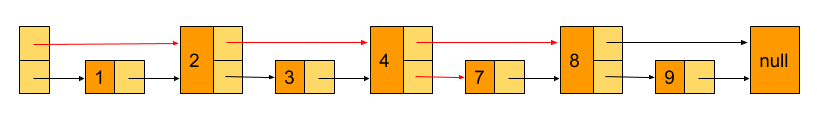

# 跳表

> 链表加多级索引的结构，就是跳表。

跳表其实是在有序的链表的基础上发展起来的，假如我们有如下这样一个单链表，最左侧的为头结点


在这样的链表中查找一个数据，需要从头开始逐个比较，时间复杂度为 O(n)。插入和删除本身的操作为 O(1)，但是因为都需要先找到其前节点，所以实际的时间复杂度也为 O(n)

假如我们每相邻两个节点增加一个指针，并让指针指向下一个节点



这样新加的指针其实又组成了一个新的链表，而且新的链表包含的节点只有原来的一半。此时假如我们想找值为 7 的这个节点，我可以从下图中标红的路线进行查找。



因此我们可以看到，我们加了一层指针之后，查找一个结点需要遍历的次数变少了，也就是查找效率变高了，那我们再加几层呢？

这样的查找方式就非常类似于一个二分查找，使得查找的时间复杂度可以降低到 O(logn)。但这种插入方式其实是存在一定的问题的，当我们不停地往跳表中插入数据时，如果我们不更新索引，就有可能出现某两个索引结点之间数据非常多的情况。极端情况下，跳表还会退化成单链表。

作为一种动态数据结构，我们需要某种手段来维护索引与原始链表大小之间的平衡，也就是说，如果链表中结点多了，索引结点就相应地增加一些，避免复杂度退化，以及查找、插入、删除操作性能下降。

## Tips

虽然空间复杂度是 O(n)，但是在实际工作中，我们要排序的都是数据量很多的对象，而我们建立索引时只需要少量排序需要的数据即可，这部分空间与对象占用的空间相比其实很多情况下都是可以忽略不计的了。

## 实现

```ts
type Sort = {
  sortKey: number // 用于排序
}

class SkipList<T extends Sort> {
  private head: SkipListNode<T> // 跳表头结点
  private level = 1 // 跳表目前的最高索引层

  private MAX_LEVEL = 16
  private SKIPLIST_PROBAILITY = 0.5

  constructor() {
    this.head = new SkipListNode<T>(Number.MIN_VALUE, null, this.level)
  }

  /**
   * 理论来讲，一级索引中元素个数应该占原始数据的 50%，二级索引中元素个数占 25%，三级索引12.5% ，一直到最顶层。
   * 因为这里每一层的晋升概率是 50%。对于每一个新插入的节点，都需要调用 randomLevel 生成一个合理的层数。
   * 该 randomLevel 方法会随机生成 1~MAX_LEVEL 之间的数，且 ：
   *    50%的概率返回 1
   *    25%的概率返回 2
   *    12.5%的概率返回 3 ...
   */
  private randomLevel() {
    let level = 1
    while (Math.random() < this.SKIPLIST_PROBAILITY && level < this.MAX_LEVEL) {
      level++
    }
    return level
  }

  public insert(value: T) {
    const level = this.randomLevel() // 获得该结点需要建立的索引层级
    const newNode = new SkipListNode(value.sortKey, value, level)
    const prevNodes = new Array(level)
    let p = this.head
    for (let i = level - 1; i >= 0; i--) {
      while (p.nextNodes[i] && p.nextNodes[i].sortKey < value.sortKey) {
        p = p.nextNodes[i]
      }
      // 将需要向下寻找的结点记录下来
      prevNodes[i] = p
    }

    for (let i = 0; i < level; i++) {
      // 第一层为原始结点，其余只需要存储索引结点即可
      newNode.nextNodes[i] = prevNodes[i].nextNodes[i]
      prevNodes[i].nextNodes[i] = newNode
    }

    if (level > this.level) {
      this.level = level
    }
  }

  public findNode(sortKey: number) {
    let p = this.head
    for (let i = this.level - 1; i >= 0; i--) {
      while (p.nextNodes[i] && p.nextNodes[i].sortKey < sortKey) {
        p = p.nextNodes[i]
      }
    }

    if (p.nextNodes[0] && p.nextNodes[0].sortKey === sortKey) {
      return p.nextNodes[0]
    }
    return null
  }

  public delete(sortKey: number) {
    let p = this.head
    const prevNodes = []
    for (let i = this.level - 1; i >= 0; i--) {
      while (p.nextNodes[i] && p.nextNodes[i].sortKey < sortKey) {
        p = p.nextNodes[i]
      }
      prevNodes[i] = p
    }

    if (p.nextNodes[0] && p.nextNodes[0].sortKey === sortKey) {
      const node = p.nextNodes[0]
      for (let i = this.level - 1; i >= 0; i--) {
        if (
          prevNodes[i].nextNodes[i] &&
          prevNodes[i].nextNodes[i].sortKey === sortKey
        ) {
          prevNodes[i].nextNodes[i] = prevNodes[i].nextNodes[i].nextNodes[i]
        }
      }
      return node
    }
    // 如果删除了最高一层索引，需要更新 level
    while (this.level > 1 && !this.head.nextNodes[this.level]) {
      this.level--
    }

    return null
  }
}

class SkipListNode<T> {
  sortKey: number // 用于排序
  value: T | null
  maxLevel: number // 该节点的最大索引层级
  // 用于记录该结点每一层级的下一个「右边的」结点
  // 例如 this.nextNodes[2] 就为第二层级下该节点的下一个结点
  nextNodes: SkipListNode<T>[]

  constructor(sortKey: number, value: T | null, maxLevel: number) {
    this.sortKey = sortKey
    this.value = value
    this.maxLevel = maxLevel
    this.nextNodes = []
  }
}

const nodes = [
  { sortKey: 1, value: 'haoqin1' },
  { sortKey: 4, value: 'haoqin2' },
  { sortKey: 8, value: 'haoqin3' },
  { sortKey: 5, value: 'haoqin4' },
  { sortKey: 2, value: 'haoqin5' },
  { sortKey: 3, value: 'haoqin6' }
]

const list = new SkipList()
for (let i = 0; i < nodes.length; i++) {
  list.insert(nodes[i])
}
console.info(list)
console.info(list.findNode(4))
```

## 参考链接

https://juejin.im/post/6844903446475177998#heading-6

