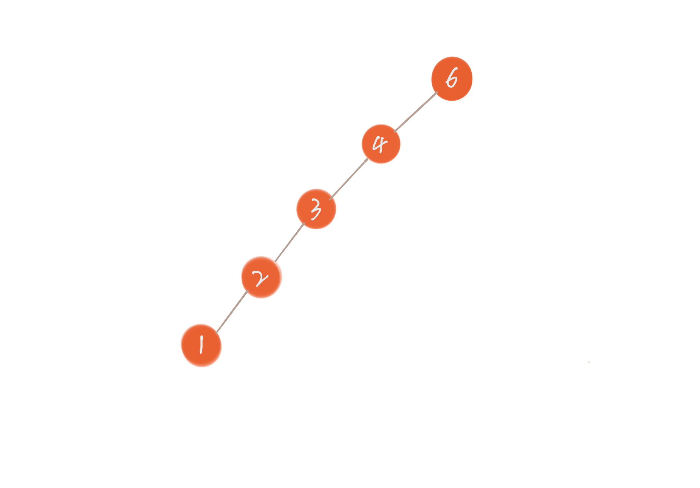

# 二叉树

> 二叉树「binary tree」是指树中节点的度不大于 2 的有序树，它是一种最简单且最重要的树。二叉树的递归定义为：二叉树是一棵空树，或者是一棵由一个根节点和两棵互不相交的，分别称作根的左子树和右子树组成的非空树；左子树和右子树又同样都是二叉树

- 高度：节点到叶子节点的最长路径
- 深度：根节点到这个节点所经历的边的个数
- 层数：节点的深度 +1

## 存储

**链式存储**

每个节点有三个字段，其中一个存储数据，另外两个是指向左右子节点的指针。


**顺序存储法**

根节点存储在下标为 i = 1 的位置，左子节点存储在下标 2 _ i = 2 的位置，右子节点存储在 2 _ i + 1 = 3 的位置


如果节点 X 存储在数组中下标为 i 的位置，下标为 2 _ i 的位置存储的就是左子节点，下标为 2 _ i + 1 的位置存储的就是右子节点。反过来，下标为 i / 2 的位置存储就是它的父节点。

## 遍历

- 前序遍历：本节点 -> 左子节点 -> 右子节点
- 中序遍历：左子节点 -> 本节点 -> 右子节点
- 后续遍历：左子节点 -> 右子节点 -> 本节点

```ts
const preOrder(node: TreeNode) {
  if (node === null) return
  console.info(node)
  preOrder(node.left)
  preOrder(node.right)
}

const inOrder(node: TreeNode) {
  if (node === null) return
  inOrder(node.left)
  console.info(node)
  inOrder(node.right)
}

const postOrder(node: TreeNode) {
  if (node === null) return
  postOrder(node.left)
  postOrder(node.right)
  console.info(node)
}
```

## 平衡二叉树

假设我们先插入 6，再插入 4，3，2，1，这样二叉查找树就退化为一条链表，查找时间复杂度顿时退化成了 O(n)。因此为了避免这种情况，我们引申出了平衡二叉树。



## AC 自动机

[参考链接]https://zhuanlan.zhihu.com/p/80325757
